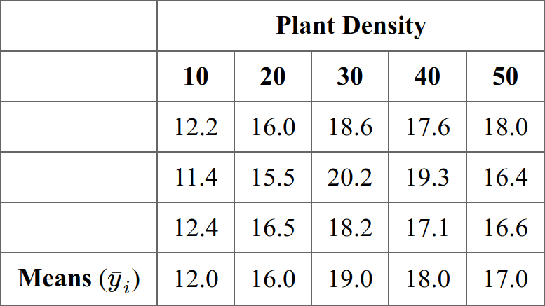

---
title:  "STAT340: Discussion 12"
author: "Keith Levin and Bi Cheng Wu"
documentclass: article
classoption: letterpaper
output:
  html_document:
    highlight: tango
    fig_caption: false
---

<style>
table{width:50%!important;margin-left:auto!important;margin-right:auto!important;}
ol[style*="decimal"]>li{margin-top:20px!important;}
</style>

```{r setup, include=FALSE}
# check packages installed
knitr::opts_chunk$set(echo=T,tidy=F,strip.white=F,fig.align="center",comment=" #",message=F,warning=F)
options(width=120)
```

<br/>

[Link to source file](ds12.Rmd)


## Exercises


### 1) One-way ANOVA

This problem comes from a Penn State example. An experiment tested 5 different plant densities and their effects on growth yield. The yields for 3 replicates of each group are shown below:

<center></center>

 1. You wish to compare the means of all groups. Write down the appropriate hypotheses to test here.
 2. Construct an ANOVA table by hand. What is your statistic and its distribution under the null?
 3. Derive a $p$-value and interpret it in the context of the problem.
 4. Finally, load your data into `R` and check your calculations are correct.
 5. If there was a significant result, conduct an appropriate post-hoc test. Which test did you choose and why? What result do you obtain?
 6. Check the assumptions of your model. Do they appear to be well satisfied?

<br/>

### 2) Two-way ANOVA

This problem comes from a data set on battery life. This experiment has 3 levels of types of battery materials and 3 temperatures. Each "cell" of the experiment has 4 replicates. A table of the data is also shown below:

<center></center>

 - Repeat the steps of the previous exercise here, but this time use a two-way model with interaction. I.e. please make a table by hand, interpret the results, and then check your table and assumptions using `R`.

<br/><br/><br/>
