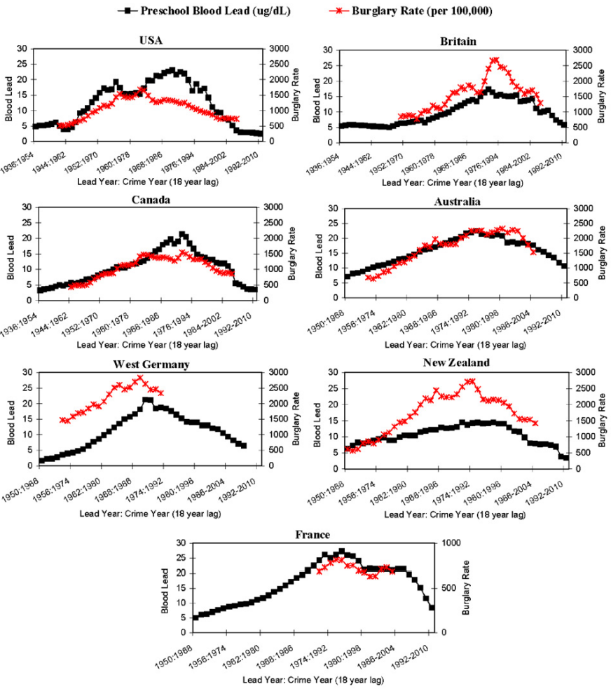
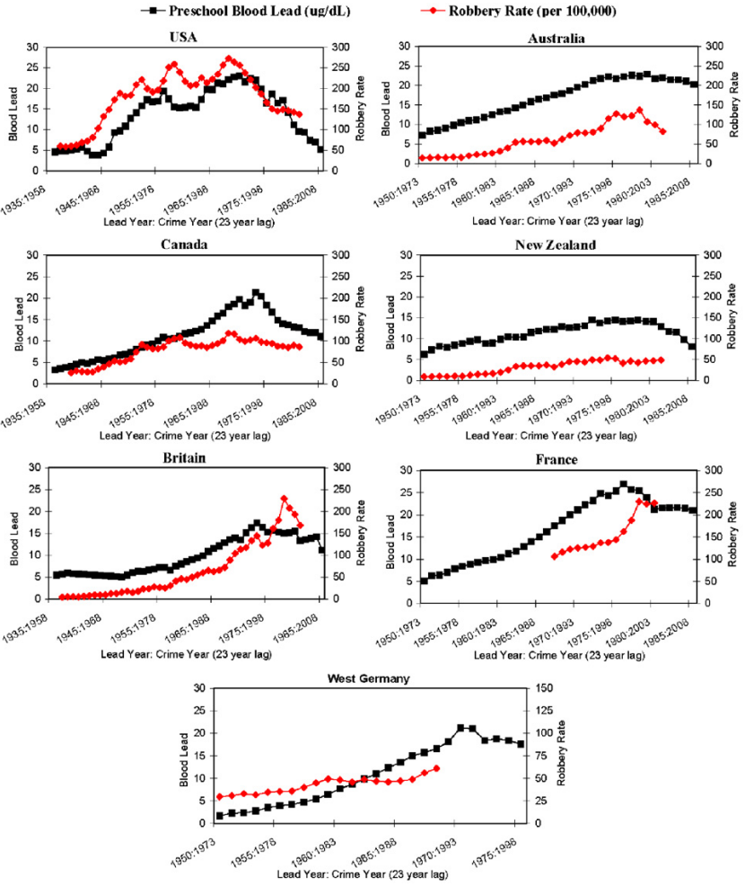
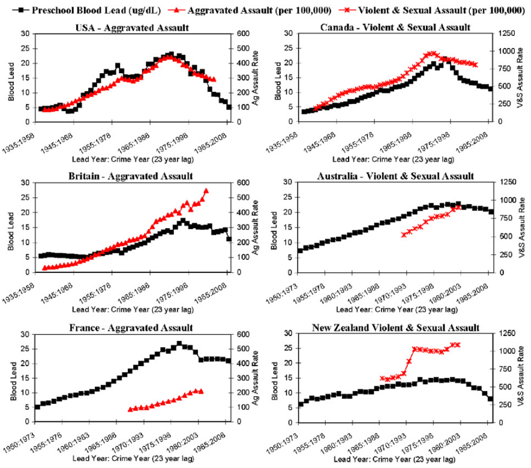

---
title: "STAT340 Lecture 06: Prediction (regression & classification)"
author: "Keith Levin and Bi Cheng Wu"
date: "October 2021"
output: html_document
---

These notes on *prediction* are based on Karl Rohe's.

# Prediction    

In a prediction problem, you are given data pairs $(X_1, Y_1), (X_2, Y_2), \dots, (X_n, Y_n)$ and you want to use $X_i$ to predict $Y_i$.  We typically imagine $X_i$ as containing several values (i.e. it is a "vector").  

There are two types of prediction problems, continuous $Y_i$ and discrete $Y_i$.  For example, you might want to predict tomorrow's the price for asset $i$ using data that is available today. So, develop an historical training set, where you have information on asset $i$ from one day contained in $X_i$ and that asset's price for the next day contained in $Y_i$.  Here, stock price is continuous.  

Alternatively, you might only be interested in knowing if you should buy the stock, sell the stock, or hold the stock.  So, you develop an historical training set where $X_i$ contains the information that is available on one day. Then, you develop "labels" $Y_i$ using data from the next day that say whether you should have bought, sold, or held onto the asset.  Here, the label (buy, sell, hold) is discrete.  

We will often call continuous outcomes "regression" and discrete outcomes "classification".

Alternatively, perhaps we want to make predictions about the 2020 election.  You could try to predict who is going to win (classification) or the number of delegates/votes that the Republicans recieve (regression).  

In the cases above, there are two natural versions of the same problem (one is regression and one is classification).  However, many classification problems do not have an analogous regression problem.  For example, in the handwritten digit example in [Chapter 1 of ISLR](http://pages.stat.wisc.edu/~karlrohe/ht/01-introduction.pdf), $X_i$ is an image of a handwritten digit and $Y_i$ is a label that says whether the digit is 0, 1, 2, 3, 4,... , or 9.  

We are going to imagine two broad approaches to regression and classification.  

1)  **Model-based approaches** parameterize the distribution of $Y_i$ given $X_i$.  That is, we imagine $Y_i$ being a random variable that follows some distribution and that distribution is somehow parameterized by the variables in $X_i$. 
2)  **Black-box approaches** are defined algorithmically. 

[Chapter 2 in ISLR](http://pages.stat.wisc.edu/~karlrohe/ht/02-statistical_learning.pdf) provides a broad overview of prediction. In the previous weeks of this course, Monte Carlo provided the basic computational tool; we were always working to get the problem stated as something that we could solve with Monte Carlo.  Now, the basic computational tool is numerical optimization. We will not write code to do optimization.  Instead, we will see optimization problems multiple times; it is often used to define our various techniques. 

## Regression

## Example: Simple Linear Regression (SLR)

### Background

[ISLR Chapter 2](http://pages.stat.wisc.edu/~karlrohe/ht/02-statistical_learning.pdf)

[Devore regression notes](https://www.colorado.edu/amath/sites/default/files/attached-files/ch12_0.pdf)

### Demo - Lead poisoning and violent crimes

You are encouraged to follow along here with the demo! The data below comes from real sources.

In the 1920s, [Thomas Midgley Jr.](https://en.wikipedia.org/wiki/Thomas_Midgley_Jr) discovered that adding [tetraethyllead](https://en.wikipedia.org/wiki/Tetraethyllead) to gasoline decreased engine knocking (i.e. fuel doesn't ignite correctly in engine, which may damage the engine). He won the prestigious 1923 Nichols medal for his discovery. There were other safer additives, but because he and General Motors owned a patent on tetraethyllead, they marketed it as the best option.

Later, in the 1950s to 70s, people began to realize the increased levels of lead in the atmosphere due to all the leaded gasoline being burned was causing widespread lead poisoning, with symptoms ranging from depression, loss of appetite, and amnesia to  anemia, insomnia, slurred speech, and cognitive impairment like decrease in concentration and loss of short-term memory. In the 1980s its usage was slowly phased out ^[https://archive.org/details/toxictruthscient00denw_0/page/210/mode/2up].

Later, in the late 1990s to early 2000s, researchers also realized levels of lead in the atmosphere correlated strongly with rates of violent crime later in life ^[https://ir.lawnet.fordham.edu/ulj/vol20/iss3/1] ^[https://doi.org/10.1016/j.envres.2007.02.008]. This study was first conducted in the US, but it was soon replicated in other countries and the same results were found over and over again.





Let's look at a [dataset](https://doi.org/10.1016/j.envint.2012.03.005) that contains atmospheric lead content levels and aggravated assault rates for several cities in the US and see if we can build a simple linear regression model to effectively explain the trend and make predictions. The data we are using comes from.

For simplicity, let's focus on the city of Atlanta. First, we plot the data. The variables here are metric tons of lead in atmosphere (independent/explanatory), and aggravated assault rate per million 22 years later (dependent/response).

```{r,message=F,warning=F}
library(tidyverse)

lead = read_csv("https://raw.githubusercontent.com/kdlevin-uwstat/STAT340-Fall2021/93c315a378f3fe421e7e2217f9b039471d313741/lecs/06/lead.csv")

head(lead)

atlanta_lead = lead %>% filter(city == "Atlanta")

ggplot(atlanta_lead,aes(x=air.pb.metric.tons, y=aggr.assault.per.million)) + 
  geom_point() + labs(x="Lead in air (metric tons)",
                      y="Aggravated assault rate (per million)",
                      title="Violent crime v. atmospheric lead (22 year lag)")
```

The data is a little wider at one side than the other side, but the trend does appear to be pretty linear. We can use the `geom_smooth()` function to get `ggplot` to plot the line of best fit for us before we fit it manually ourselves.

```{r}
ggplot(atlanta_lead,aes(x=air.pb.metric.tons,y=aggr.assault.per.million)) + 
  geom_point() + geom_smooth(method="lm", formula="y~x", se=F) + 
  labs(x="Lead in air (metric tons)",
       y="Aggravated assault rate (per million)",
       title="Violent crime v. atmospheric lead (22 year lag)")
```

To build a linear model, the syntax is as simple as `lm(y~x, data=df)`. Running `summary()` on the model object gives us a variety of useful summary statistics and other information about the model.

```{r}
atlanta_lead_lm = lm(aggr.assault.per.million ~ air.pb.metric.tons, data=atlanta_lead)
summary(atlanta_lead_lm)
```

You can also access key properties of the model using certain built in functions

```{r}
# gets fitted y-values (points on line of best fit)
fitted(atlanta_lead_lm)

# gets residuals (difference between actual y and fitted y)
residuals(atlanta_lead_lm)             # can also use resid()

# gets coefficients of model
coefs = coefficients(atlanta_lead_lm)  # can also use coef()
coefs
```

We can plot our model just to make sure it looks correct and appropriate.

```{r}
ggplot(atlanta_lead,aes(x=air.pb.metric.tons,y=aggr.assault.per.million)) + 
  geom_point() + 
  geom_abline(slope=coefs[2], intercept=coefs[1], color="red") + 
  labs(x="Lead in air (metric tons)",
       y="Aggravated assault rate (per million)",
       title="Violent crime v. atmospheric lead (22 year lag)")
```

Note the summary tells us that our slope estimate is significant. This basically conducts a $t$-test to see if it's significantly different from 0. In this case it is. Note that this is strictly speaking **correlation, NOT causation**. However, it's a **very suspicious correlation** and warrants further studies and analysis. We can also get confidence intervals for our coefficients.    

```{r}
confint(atlanta_lead_lm, level=0.95)
```

At the very least, lead in air is **a useful predictor** for levels of violent crime 22 years later. For example, suppose tomorrow, a chemical company near Atlanta has an explosion, and some more lead is released into the atmosphere. New measurements of lead are found to be 1300 metric tons. What would you predict the approximate aggravated assault rate in 2043 to be?

```{r}
predict(atlanta_lead_lm, newdata=data.frame(air.pb.metric.tons=1300))
```

Suppose the lead factory continues to release more lead into the atmosphere, and next year, the levels are measured to be 2000 metric tons. Can we use our model to predict what aggravated assault rates in 2044 might look like?

```{r}
predict(atlanta_lead_lm, newdata=data.frame(air.pb.metric.tons=2000))
```

These predictions have to be treated more carefully, since they are out of the range of our data. They may be reliable, but they also may not. The reliability of a prediction usually decreases the further away it is from your data.

<center><a href="https://xkcd.com/1007/"></a></center>


## Classification example

Example: logistic regression. Very similar to simple linear regression, but applied to predicting categories.    
[ISLR chapter 4](http://pages.stat.wisc.edu/~karlrohe/ht/04-classification.pdf)


