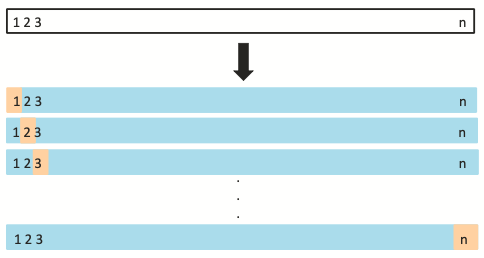
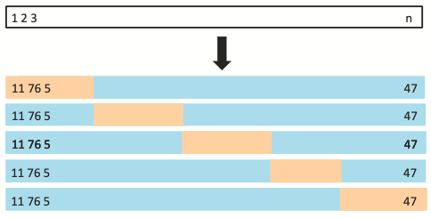

```{r setup, include=FALSE}
knitr::opts_chunk$set(echo = TRUE)

require(ggplot2)
```

__Readings:__ ISLR Section 5.1, Sections 6.1-6.4

Several times this semester, we have discussed methods that required the choice of a number of components, clusters or dimensions.

__Example:__ in $k$-means, we fit $k$ clusters to our data. How do we choose $k$?

__Example:__ in PCA, how do we decide how many principal components to keep?

__Example:__ Suppose we have a data set with hundreds or even thousands of predictor variables. How do we decide which variables to include in linear regression (or any other prediction model)?

These are all examples of *model selection* problems.
That name is a bit confusing at first-- it sounds like there must be a statistical model involved!

In the case of our variable selection example, there is in fact a statistical model-- linear regression makes very specific assumptions about the data distribution-- but we use the term "model selection" more broadly to mean situations like those above, in which we have to choose among many different *similar* ways of describing the data.

For example, do we "model" the data as coming from $3$ or $4$ clusters?

We'll focus in this lecture specifically on selecting variables for linear regression.
Later this week, we will see ways of doing model selection for other tasks, such as clustering.

## How do we compare models?

Let's consider a very simple example (adapted from Section 3.3.2 and Section 5.1 in ISLR).

The `mtcars` data set is a classic data set that comes packaged in R.

```{r}
data('mtcars');
head(mtcars);
```

Let's confine our attention to the `mpg` (miles per gallon) and `hp` (horsepower) variables.
Can we predict gas mileage from the horsepower?

Let's try fitting linear regression.

```{r}
model1 <- lm(mpg ~ 1 + hp, mtcars);
intercept1 <- model1$coefficients[1];
slope1 <- model1$coefficients[2];

# Plot the data itself
pp <- ggplot( mtcars, aes(x=hp, y=mpg)) + geom_point();
pp <- pp + geom_abline(intercept=intercept1, slope=slope1, colour='blue' );
pp
```

Okay, it looks reasonable, but you might notice that the residuals have a bit of a weird behavior. Let's plot them to see what I mean.

```{r}
pp <- ggplot( mtcars, aes(x=hp, y=mpg-(slope1*hp+intercept1))) + geom_point()
pp
```

The residuals have a kind of U-shape.
This suggests that there is a non-linearity in the data that we are failing to capture.
Let's try adding another predictor: the squared horsepower.

```{r}
model2 <- lm(mpg ~ 1 + hp + I(hp^2), mtcars);
intercept2 <- model2$coefficients[1];
slope2_1 <- model2$coefficients[2];
slope2_2 <- model2$coefficients[3];

# Plot the data itself
pp <- ggplot( mtcars, aes(x=hp, y=mpg)) + geom_point();
# As usual, there are cleaner ways to do this plot, but this is the quick and easy way to make itt.
# If we were doing this more carefully, we would evaluate the cureve in the plot at more x-values than just the ones in the data to smooth things out.
pp <- pp + geom_line( aes(x=hp, y=intercept2 + slope2_1*hp + slope2_2*I(hp^2) ), colour='red' );
pp
```

That looks like quite an improvement!
Just for comparison:

```{r}
pp <- ggplot( mtcars, aes(x=hp, y=mpg)) + geom_point();
pp <- pp + geom_abline(intercept=intercept1, slope=slope1, colour='blue' );
pp <- pp + geom_line( aes(x=hp, y=intercept2 + slope2_1*hp + slope2_2*I(hp^2) ), colour='red' );
pp
```

We can also compare the squared residuals to confirm that adding the feature `hp^2` actually decreased our error:

```{r}
c( sum( model1$residuals^2 ), sum( model2$residuals^2 ) );

```

Why stop there? Why not add `hp^3` as well, or even `hp^4`?
Well, funny enough, that is precisely the idea behind *polynomial regression*, which you can learn more about in ISLR (Section 3.3.2; more substantial discussion in Chapter 7) or in a regression course.

But that raises the question: how do we know when to stop?

-You'll find that if you add `hp^3` to the model above, that the sum of squared residuals does indeed improve.

-But how do we know if that improvement is worth it?

One approach to this problem would be to examine the $p$-values associated to the coefficients. See ISLR Chapter 3 for a discussion of that approach.

In these notes, we will see a different, arguably more principled approach.

### Overfitting and Unseen Data

If we keep adding more predictors to our model, the residuals will continue to decrease, but this will not actually mean that our model is better.
Instead, what we will be doing is *over-fitting* to the data.
That is, our model will really just be "memorizing" the data itself rather than learning a model.

The true test of model quality is how well it does at predicting for data that we *didn't* see.

That is, if we fit our model on data $(X_i,Y_i)$ for $i=1,2,\dots,n$, how well does our model do on the previously unseen $(X_{n+1},Y_{n+1})$?

Specifically, in the case of regression, we want our model to minimize
$$
\mathbb{E} \left( \hat{Y}_{n+1} - Y_{n+1} \right)^2,
$$
where $\hat{Y}_{n+1} = \hat{\beta} X_{n+1}$, with $\hat{\beta}$ being learned from our $n$ training observations.

## Validation Sets

So rather than focusing on how well our model fits our training data, we should be trying to determine how well our model does when it gets applied to data that we haven't seen before.

Specifically, we would like to know the mean squared error (MSE),
$$
\mathbb{E} \left( \hat{Y}_{n+1} - Y_{n+1} \right)^2.
$$
__Note:__ The name is hopefully clear-- it is the expectation (mean) of the squared error between our prediction and the truth.

If you've taken an ML course, this idea should already be quite familiar. We always train ("fit" in the language of statistics) our model on a *training set*, and then assess how well the model performs on a *test set* that our model hasn't seen before.

The trouble is that in most statistical problems, we have at most a few hundred data points to work with.
As a result, we can't really afford to set aside some of our data just to use as a test set.

Note that this is in contrast to many machine learning settings (e.g., training a neural net), where we often have tens or hundreds of thousands of data points to work with.

Following the logic of the train/test split idea in ML, though, a natural approach is to do the following:

1. Split our data into two parts, say $S_1,S_2$, such that $S_1 \cup S_2 = \{1,2,\dots,n\}$ and $S_1 \cap S_2 = \emptyset$.

2. Obtain estimate $\hat{\beta}_1$ by fitting a model on the observations in $S_1$

3. Evaluate the error of our fitted model on $S_2$,
$$
\hat{E}_1
=
\frac{1}{|S_2|} \sum_{i \in S_2} \left( Y_i - \hat{\beta}_1 X_i \right)^2.
$$

Typically, we call $S_2$, the set that we make predictions for, the *validation set*, because it is validating our model's performance.

Let's see this in action on the `mtcars` data set.

We randomly split the data set into two groups. For each model order 1, 2, 3, 4 and 5, we fit the model to the training set and then measure the sum of squared residuals of that model when applied to the validation set.

One run of this experiment is summarized in `resids_onerun`.
For details, refer to `mtcars_poly.R`, which is included among the supplementary files for this lecture.

```{r}
source('mtcars_poly.R');

head(resids_onerun);
```


```{r}
# Plot these results
pp <- ggplot(resids_onerun, aes(x=Order, y=log(Error) ) );
pp <- pp + geom_line( size=1)
pp

```

Let's pause to make sure that we understand what this plot actually shows.
We split the `mtcars` dataset randomly into two sets, a "training" set and a "validation" set.
For each order (1, 2, 3, 4, 5), we fit a model of that order to the training set.
Then we use that model to try and predict the outcomes (`mpg`) on the validation set.
So this is the performance of five different models, trained on the same data and evaluated on the same data.

Looking at the plot, we see that as we add higher-order powers of `hp`, we don't really gain much in terms of the error (i.e., sum of squared residuals) beyond order 2.
Indeed, past the order-2 model, the error gets worse again!

__Aside:__ this deteriorating performance is due largely to the fact that the `mtcars` data set is so small. Once we split it in half, we are fitting our model to just 32 observations.
Estimating four or five coefficients from only about 30 observations is asking for trouble!
This is a tell-tale sign of over-fitting of a model.
This would be a good occasion for some kind of *regularization*, but we'll come back to that.

### Variance in the residuals

There's one problem, though.
That plot shows the residuals as a function of model order for one particular random set $S_1$.
Let's plot the same residuals for a few different random sets.

__Note:__ the data frame `resids` contains multiple replicates of the above experiment. Once again, refer to the code in `mtcars_poly.R` for details.

```{r}
head(resids)
```

```{r}
pp <- ggplot(resids, aes(x=Order, y=log(Error), color=as.factor(Rep) ) );
pp <- pp + geom_line( size=1)
pp

```

Hmm. There's quite a lot of variance among our different estimates of the prediction error.

Each of these is supposed to be estimating the error
$$
\mathbb{E} \left( \hat{Y}_{n+1} - Y_{n+1} \right)^2,
$$
but there's so much variation among our estimates that it's hard to know if we can trust any one of them in particular!

Indeed, the variance is so high that we need to plot the error on a log scale! Once in a while, we get unlucky and pick an especially bad train/validate split, and the error is truly awful!
Note that the y-axis is on a log scale, so an increase from, say, 2 to 3 is an *order of magnitude* increase in error.

__Question:__ what explains the variance among the different lines in that plot?

__Question:__ How might we reduce that variance?

## Reducing the variance: Leave-one-out cross-validation

One source of variance in our cross-validation plots above was the fact that each replicate involved splitting the data in half and training on only one of the two halves.

That means that on average, from one replicate to another, the data used to train the model changes quite a lot, and hence our estimated model changes a lot.
That's where the variance comes from!

There is also the related problem that we are training on only half of the available data. As statisticians and/or machine learners, we don't like not using all of our data!

So, here's one possible solution: instead of training on half the data and validating (i.e., evaluating) on the other half, let's train on all of our data except for one observation, then evaluate our learned model on that one held-out data point.

That is, instead of splitting our data into two halves, we

1. Take one observation and set it aside (i.e., hold it out)
2. Train our model on the other $n-1$ observations
3. Evaluate our model on the held-out observation.

```{r}
# This R file implements the same experiment as we saw above, but this time
# doing LOO-CV instead of 
source('mtcars_poly_loocv.R');

pp <- ggplot(resids_onerun, aes(x=Order, y=Error ) );
pp <- pp + geom_line( size=1)
pp
```

But once again, that's just one run. Let's display several of them in one plot.

```{r}
pp <- ggplot(resids, aes(x=Order, y=log(Error), color=as.factor(Rep) ) );
pp <- pp + geom_line( size=1)
pp
```

For each of our replicates, we are estimating our model based on $n-1$ of the observations, and then evaluating our prediction on the one held-out observation.

But now we have a different kind of variance: our estimate of the error is at the mercy of the one observation that we chose to hold out.
If we chose an especially "bad" observation to hold out, then our error might be especially high.

Leave-one-out cross-validation (LOO-CV) tries to bridge this gap (i.e., balancing the better stability of leaving one observation out with the variability induced by evaluating on a single point) by:

For each $i=1,2,\dots,n$:

1. Train the model on $\{ (X_j, Y_j) : i \neq i \}$.
2. Evaluate on $(X_i, Y_i)$.
3. Average the model error over all $i =1,2,\dots,n$.

This illustration from ISLR should give you the general idea.



Let's see that in action. As we have done many times this semester, this code is optimized for clarity and readability, not for concision or "cleverness".
There are much more "graceful" ways of doing this, and shortly we'll see R's built-in CV tools, which are what we would normally use for this.
But here the goal is to illustrate the core ideas in a really obvious way, hence the "clumsy" code.

```{r}

data('mtcars'); # Still using mtcars data; reloading it just to remind us.

nrows <- nrow(mtcars); # Number of observations in the data
norder <- 5;
# For each choice of observation to hold out, we need to record the score
# (i.e., squared erro) for each of the five model orders.
errors <- data.frame( 'Row'=rep(1:nrows, each=norder),
                     'Order'=rep(1:norder, times=nrows),
                                 'Error'=rep(NA, nrows*norder));

for ( i in 1:nrow(mtcars) ) {
  train_data <- mtcars[-c(i),]; # Leave out the i-th observation
  leftout <- mtcars[c(i),]; # the row containing the left-out sample.
  
  # Remember, we are fitting five different models
  # So that we can compare them.
  
  # Fit the linear model, then evaluate.
  m1 <- lm(mpg ~ 1 + hp, train_data );
  m1.pred <- predict( m1, leftout );
  idx <- (errors$Row==i & errors$Order==1); # Pick out row of the errors df.
  # record squared error btwn predict and truth
  errors[idx,]$Error <- (m1.pred - leftout$mpg)^2 ; 
  
  # Fit the quadratic model, then evaluate.
  m2 <- lm(mpg ~ 1 + hp + I(hp^2), train_data );
  m2.pred <- predict( m2, leftout );
  idx <- (errors$Row==i & errors$Order==2); # Pick out row of the errors df.
  # record squared error btwn predict and truth
  errors[idx,]$Error <- (m2.pred - leftout$mpg)^2; 

  # Fit the cubic model, then evaluate.
  m3 <- lm(mpg ~ 1 + hp + I(hp^2) + I(hp^3), train_data );
  m3.pred <- predict( m3, leftout );
  idx <- (errors$Row==i & errors$Order==3); # Pick out row of the errors df.
  # record squared error btwn predict and truth
  errors[idx,]$Error <- (m3.pred - leftout$mpg)^2; 
  
  # Fit the 4-th order model, then evaluate.
  m4 <- lm(mpg ~ 1 + hp + I(hp^2) + I(hp^3) + I(hp^4), train_data );
  m4.pred <- predict( m4, leftout );
  idx <- (errors$Row==i & errors$Order==4); # Pick out row of the errors df.
  # record squared error btwn predict and truth
  errors[idx,]$Error <- (m4.pred - leftout$mpg)^2; 
  
  # Fit the 5-th order model, then evaluate.
  m5 <- lm(mpg ~ 1 + hp + I(hp^2) + I(hp^3) + I(hp^4) + I(hp^5), train_data );
  m5.pred <- predict( m5, leftout );
  idx <- (errors$Row==i & errors$Order==5); # Pick out row of the errors df.
  # record squared error btwn predict and truth
  errors[idx,]$Error <- (m5.pred - leftout$mpg)^2;
}

```

Okay, so let's make sure that we understand what is going on, here.

The data frame `errors` now has `nrows*norders` rows.
So for each observation in the cars data set, there are five entries in the table `errors`, recording the squared error for the models of order 1, 2, 3, 4 and 5 when that data point was held out.

We said that when we do CV, we want to average across the $n$ observations, so let's do that.
We're going to use the `aggregate` function, which is one of the ways to perform "group-by" operations in R.

Group-by operations are where we pool our observations into subsets according to some criterion, and then compute a summary statistic over all of the observations in the same subset (i.e., the same "group").

Using that language, we want to group the rows of `errors` according to model order, and take the average squared error within each order.

```{r}
# Error ~ Order tells R to group the data according to the Order column
# and that we want to summarize the Error column within observations
# of the same Order.
# Passing the FUN=mean argument tells R that the summary statistic we want to use
# is the function mean().
# We could pass other summary statistic functions in this argument.
# For example, we could use median, sd, var, max, etc.,
# though those would be a bit silly here.
err_agg <- aggregate(Error ~ Order, data=errors, FUN=mean);

head(err_agg)
```

And we can plot that just to drive the point home.

```{r}
pp <- ggplot(err_agg, aes(x=Order, y=log(Error) ) );
pp <- pp + geom_line( size=1)
pp
```

### Recap: single split versus LOO-CV

So far we have seen two different ways of estimating a model's performance on unseen data.

The first was to randomly split the data into two sets, train on one and evaluate on the other.

  __Pro:__ Only have to fit a model once (or just a few times, if we are going to repeat the operation and average)

  __Con:__ Only have half of the data available to fit the model, which leads to less accurate prediction (and thus high variance in estimated model).

The second is __leave-one-out cross-validation__.

  __Pro:__ Use all but one observation to fit the model, so model fit is almost as good as if we had used all of the data

  __Con:__ Have to fit the model anew for each held-out data point, results in fitting the model $n$ different times, which can be expensive.
  
  __Con:__ Because any two training sets overlap in all but one of their elements, our fitted models are very highly correlated with one another, so we're doing a lot of work ($n$ model fits) to get a bunch of highly correlated measurements.
  
So the natural question is whether or not we can bridge the gap between these two extremes.

### The happy medium: $K$-fold cross validation

Well, there are a few different ways to bridge this gap, for example using Monte Carlo methods.
Let's discuss the most popular one here.

We'll borrow a bit from the LOO-CV idea, while lessening the correlatedness of the models fits.

$K$-fold CV randomly divides the data into $K$ subsets, called *folds*.
Then, one at a time, we hold out one of the folds, train our model on the $K-1$ remaining folds, and evaluate our model's prediction error on the held-out fold.
Then, we can average the errors across the $K$ folds.

That is, the "recipe" for $K$-fold cross-validation is

1. Randomly partition the data into $K$ (approximately) same-sized subsets, $S_1,S_2,\dots,S_K$ such that $\cup_k S_k = \{1,2,\dots,n\}$ and $S_k \cap S_\ell = \emptyset$ for all $k \neq \ell$
2. For each $k=1,2,\dots,K$, train a model on the observations indexed by $i \in \cup_{\ell \neq k} S_\ell$ and compute the prediction error
$$
\hat{E}_k =  \frac{1}{|S_k|} \sum_{i \in S_k} (\hat{y}_i - y_i)^2
$$

3. Estimate the true error $\mathbb{E} (\hat{y}_{n+1} - y_{n+1})^2$ as
$$
\frac{1}{K} \sum_{k=1}^K \hat{E}_k,
$$
Schematically, this looks something like this (with $K=5$):



Let's implement this in R, just for the practice.
Once again, R has built-in tools for making this easier, which we will discuss later, but this is a good opportunity to practice our R a bit.

```{r}
data('mtcars'); # We'll continue to use the mtcars data set
K <- 5; # 5-fold regularization. K between 5 and 10 is a fairly standard choice

# The first thing we need to do is partition the data into K folds.
# There are many different ways to do this,
# including using functions from other packages
# (e.g., https://www.rdocumentation.org/packages/caret/versions/6.0-90/topics/trainControl)
# But here's an approach using the R function split() that I like
n <- nrow(mtcars);
# sample(n,n,replace=FALSE) really just randomly permutes the data.
# Then, passing that into the split function assigns these to the K different
# factors defined by as.factor(1:K).
# See ?split for more information.
Kfolds <- split( sample(1:n, n,replace=FALSE), as.factor(1:K));
# Note that this will throw a warning in the event that K does not divide n
# evenly. That's totally fine!

Kfolds
```

Now, for each of these $K=5$ folds, we'll set it aside, train on the remaining data, and evaluate on the fold.

```{r}
# The file mtcars_Kfold.R defines a function that trains the five different-order
# models and evaluates each one according to the given holdout set.
# It largely repeats the structure of the LOO-CV code implemented above,
# hence why it is relegated to a file for your later perusal.
source('mtcars_Kfold.R');

# Set up a data frame to hold our residuals.
norder <- 5;
Kfold_resids <- data.frame( 'Order'=rep(1:norder, each=K),
                            'Fold'=rep(1:K, norder ),
                            'Error'=rep(NA, K*norder) );

for (k in 1:K ) {
  heldout_idxs <- Kfolds[[k]]; # The indices of the k-th hold-out set.
  
  # Now train the 5 different models and store their residuals.
  idx <- (Kfold_resids$Fold==k);
  Kfold_resids[idx, ]$Error <- mtcars_fit_models( heldout_idxs );
  
}

head(Kfold_resids)
```

Now, we need to aggregate over the $K=5$ folds, and then we can plot the errors.
Once again, we need to use a log scale for the errors, because the higher-order models cause some really bad prediction errors on a handful of "bad" examples.
```{r}
KF_agg <- aggregate(Error ~ Order, data=Kfold_resids, FUN=mean);

pp <- ggplot(KF_agg, aes(x=Order, y=log(Error) ) );
pp <- pp + geom_line( size=1)
pp
```

Once again, the order-2 model, `mpg ~ 1 + hp + hp^2`, does best (usually, anyway-- occasionally the order-3 model is slightly better due to randomness on this small data set).

## Aside: the bias-variance decomposition

__Note:__ This subsection includes a lot of math, including a lot of expectation and variance terms and taking expectations with respect to some variables but not others.
You __are not__ responsible for these details on an exam.
The important thing to take away from this subsection is the *concept* of the bias-variance decomposition of the means squared error (MSE),
in which we can write the MSE as a variance term plus a squared bias.

Suppose that we have a quantity $\theta$ that we want to estimate,
and we have an estimator $\hat{\theta}$, the *mean squared error* is defined as
$$
\operatorname{MSE}(\hat{\theta}, \theta)
= \mathbb{E} \left( \hat{\theta} - \theta \right)^2.
$$

For example, in our CV examples above, we wanted to estimate the squared error on a previously unseen data point, $\mathbb{E}( \hat{Y}_{n+1} - Y_{n+1} )^2$.
Note that even though this looks kind of like MSE, it is *not*.
This quantity is $\theta$ in our MSE expression above.
It is a thing we want to estimate.
Our love of squared errors has caused us to have a whole mess of colliding notation. Such is life.

__Important point:__ we are taking expectation here with respect to the random variable $\hat{theta}$. Its randomness comes from the data itself (which we usually assume to depend on the true parameter $\theta$ in some way).

Now, let's expand the MSE by adding and subtracting $\mathbb{E} \hat{\theta}$ inside the square:
$$
\newcommand{\E}{\mathbb{E}}
\newcommand{\thetahat}{\hat{\theta}}
\begin{aligned}
\operatorname{MSE}
&= \E \left( \thetahat - \theta \right)^2 \\
&= \E \left( \thetahat - \E \thetahat + \E \thetahat - \theta \right)^2 \\
&= \E\left[  \left( \thetahat - \E \thetahat \right)^2
           + 2\left( \thetahat - \E \thetahat \right)
           + \left( \E \thetahat - \theta \right)^2 \right] \\
&= \E \left( \thetahat - \E \thetahat \right)^2
  +  \E 2\left( \thetahat - \E \thetahat \right)
                \left( \E \thetahat - \theta \right)
  + \E \left( \E \thetahat - \theta \right)^2.
\end{aligned}
$$
Now, let's notice that $\theta$ and $\mathbb{E} \hat{\theta}$ are not random, so they can get pulled out of the expectation (along with the factor of $2$, which is also not random!).
we can write (again, remember that the expectation is over $\hat{\theta}$, while $\theta$ is non-random)
$$
\newcommand{\E}{\mathbb{E}}
\newcommand{\thetahat}{\hat{\theta}}
\E 2\left( \thetahat - \E \thetahat \right) \left( \E \thetahat - \theta \right)
= 2 \left( \E \thetahat - \theta \right) \E \left( \thetahat - \E \thetahat \right)
    = 0,
$$
because
$$
\mathbb{E}\left(\hat{\theta} - \mathbb{E} \hat{\theta} \right)
= \mathbb{E} \hat{\theta} - \mathbb{E} \hat{\theta}
= 0.
$$

Plugging this into our equation above, we conclude that
$$
\newcommand{\E}{\mathbb{E}}
\newcommand{\thetahat}{\hat{\theta}}
\operatorname{MSE}
= \E \left( \thetahat - \E \thetahat \right)^2
+ \E \left( \E \thetahat - \theta \right)^2.
$$

The first term on the right is just a variance-- like $\mathbb{E}(X - \mathbb{E}X)^2$.

The second term on the right is the expectation of $(\mathbb{E} \hat{\theta} - \theta)^2$.
But this term isn't random at all-- $\theta$ is a fixed parameter, and $\mathbb{E} \hat{\theta}$ is just an expected value (i.e., not random!),
so
$$
\E \left( \E \thetahat - \theta \right)^2
= \left( \E \thetahat - \theta \right)^2,
$$
and notice that this is just the squared bias-- the square of the difference between the expectation of our estimator and the thing it is supposed to estimate.

So, to recap, we have shown that we can decompose the MSE as
$$
\operatorname{MSE}(\hat{\theta}, \theta)
= \operatorname{Var} \hat{\theta} + \operatorname{Bias}^2(\hat{\theta}, \theta).
$$

In general, there will be many different estimators (i.e., many different choices of $\hat{\theta}$) that all obtain (approximately) the same MSE.
The above equation means that once we are choosing among these different "similar" estimators (i.e., estimators that have similar MSE), we are really just trading off between bias and variance.
That is, an estimator with smaller bias will have to "pay" for it with more variance.
This is often referred to as the bias-variance tradeoff.

## CV and the bias-variance tradeoff

Now, the purpose of cross-validation is to estimate the model error $\E(\hat{Y}_{n+1}-Y_{n+1})^2$.
The bias-variance tradeoff says that, roughly speaking, different "reasonable" ways of estimating this quantity will all have about the same MSE, but will involve balancing bias against variance.

### Bias in CV

Let's think back to the "naive" cross-validation approach, in which we split the data into two sets of similar sizes, train on one and evaluate on the other.
When we do that, we train our model on a much smaller data set than if we used the full data.
The result is that we (accidentally) over-estimate the error of our model, because models trained on less data simply tend to be less accurate.

That is to say, the "naive" cross-validation approach tends to yield a biased estimate of the true error of the model.
Specifically, our estimate is biased upward.

On the other hand, LOOCV should be approximately unbiased as an estimate of the model error, because the difference between training on $n$ and $n-1$ data points should not be especially large (at least once $n$ is reasonably large).

It stands to reason that $K$-fold CV should sit at a kind of "happy medium" level of bias between LOOCV and "naive" CV.

### Variance in CV

So LOOCV is the least biased estimate of model error, but the bias-variance trade-off predicts that we must "pay" for this in variance.
It turns out that LOOCV has the most variance of LOOCV, $K$-fold CV (for $K < n$) and "naive" CV.

Intuitively, the variance in LOOCV comes from the following fact: recall that for each $i=1,2,\dots,n$, we hold out the $i$-th data point and train a model on the rest.

This means that we have $n$ different trained models, each trained on $n-1$ data points, but each pair of training sets overlap in $n-2$ of their data points.
The result is that the trained models are highly correlated with one another.
Changing just one data point in our data set doesn't change the fitted model much!

The result is that these estimated model errors are highly correlated with one another, with the result that our overall estiamte of the model error has high variance.

The $K$ models trained in $K$-fold CV are less correlated with one another, and hence we have (comparatively) less variance.
It turns out in this case that $K$ less-correlated error estimates have smaller correlation than $n$ highly-correlated ones.

### $K$-fold CV: the happy medium

Thus, $K$-fold CV is a popular choice both because it is computationally cheaper than LOOCV ($K$ model fits compared to $n$ of them) and because it strikes a good balance between bias and variance.