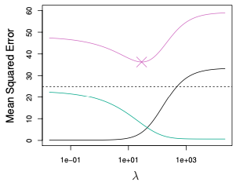

```{r setup, include=FALSE}
knitr::opts_chunk$set(echo = TRUE)

require(ggplot2)
require(glmnet)
```

__Readings:__ ISLR Sections 6.1 and 6.2

In our previous lecture, we discussed how to use cross-validation to choose among models.
We concentrated on choosing among a family of linear regression models that varied in their orders, in the sense that they included as predictors all powers of the horsepower variable `hp` up to some maximum power to predict gas mileage.
Hopefully it is clear how we could modify our approach to, say, choose which variables we do and don't include in a model (e.g., as in the Pima diabetes data set we saw in discussion section).

Ultimately, our goal was to choose, from among a set of predictors that we *could* include in our model (e.g., powers of `hp`, in the case of the `mtcars` example we saw in the last lecture), which predictors to actually include in the model.
This task is often called *variable selection*.

In this lecture, we'll see a few different approaches to variable selection that do not rely on cross-validation.
These alternative methods have the advantage of not trying to estimate the unknown model error on unseen data.
On the other hand, these methods can be more computationally intensive and tend to come with fewer theoretical guarantees.

This is not to suggest, however, that the methods in this lecture are at odds with cross-validation.
In actual research papers and in industry applications, you'll often see both CV and some of the methods presented below used in tandem to select the best model for the job.

## Learning objectives

After this lecture, you will be able to

- Explain the problem of variable selection and model selection more generally.
- Explain subset selection methods, including forward and backward stepwise selection.
- Explain and apply adjustment methods including Mallow's $C_p$, Akaike Information Criterion, Bayesian Information Criterion and adjusted $R^2$.
- Explain and apply regularization and shrinkage methods, including ridge regression and the LASSO.

## Setup: linear regression and fitting

We will focus in this lecture on linear regression, bearing in mind that the ideas introduced here apply equally well to other regression and prediction methods (e.g., logistic regression).
Let's recall that multiple linear regression models a response $Y \in \mathbb{R}$ as a linear (again, technically affine-- linear plus an intercept!) function of a set of $p$ predictors plus normal noise:
$$
Y = \beta_0 + \beta_1 X_1 + \beta_2 X_2 + \cdots + \beta_p X_p + \epsilon.
$$
Here, $\epsilon$ is mean-zero normal with unknown variance $\sigma^2 > 0$, and the variables $X_1,X_2,\dots,X_p$ are the *predictors*.
We often refer to $p$, the number of predictors, as the *dimension* of the problem, because the data (well, the vector of predictors, anyway), lies in $p$-dimensional space.
Collecting the coefficients into a vector $(\beta_0,\beta_1,\dots,\beta_p) \in \mathbb{R}^{p+1}$ and creating a vector $X=(1,X_1,X_2,\dots,X_p) \in \mathbb{R}^p$, we can write this more succinctly as (if you have not taken linear regression, you can safely ignore this, we're just including it because it's a common notation)
$$
Y = \beta^T X + \epsilon.
$$
In multiple linear regression, we observe a collection of predictor-response pairs $(X_i,Y_i)$ for $i=1,2,\dots,n$, with
$$
X_i = (1,X_{i,1},X_{i,2},\dots,X_{i,p}) \in \mathbb{R}^{p+1}.
$$
Note that here we are including the intercept term $1$ in the vector of predictors for ease of notation.
This is a common notational choice, so we're including it here to get you used to seeing this.
Of course, this is not universal-- it's one of those conventions that you have to be careful of and check what you are reading.

### Overview: variable selection

So we have $p$ variables (plus an intercept term), and we want to select which ones to include in our model.
There are many reasons to want to do this, but let's just highlight three of them:

- If there are many "useless" variables (i.e., ones that are not good predictors of the response), then including them in the model can make our predictions less accurate. Thus, we would like to proactively identify which variables are not useful, and avoid including them in the model in the first place.
- A model with fewer variables is simpler, and we like simple models! Explaining, say, heart attack risk as a function of two or three factors is a lot easier to use than a model that uses ten or twenty factors.
- If the number of predictors $p$ is too large (say, larger than $n$-- a common occurrence in genomic studies, for example), our estimates of the coefficients are very unstable. Variable selection and related tools give us a way to introduce stability in the form of *regularization*, which we will talk about below.

## Best subset selection

So, we have $p$ predictor variables available to us, and we want to choose which of them to actually include in our model.

Well, the most obvious solution is to just try all possible combinations of features, train a model using each combination, and keep the best one (measured by, say, residual sum of squares).

This would have an obvious drawback: we have already seen that we can trivially improve the RSS of our model by adding variables.
So the models that include more variables would do better, even if those variables did not actually lead to better model error on unseen data.

The solution to this is to do the following:

1. For each $k=1,2,\dots,p$, for every set of $k$ different variables, fit a model and keep the model that best fits the data (measured by RSS). Call this model $M_k$.
2. Use CV (or some other tool like AIC or adjusted $R^2$, which we'll discuss below) to select among the models $M_1,M_2,\dots,M_p$.

This is called *best subset selection*.
It is implemented in R in, for example, the `leaps` library the function `regsubsets`, which gets called in more or less the same way as `lm`.
See (here)[https://cran.r-project.org/web/packages/leaps/index.html] for documentation if you're interested.

There is one rather glaring problem with best subset selection, though:

__Question:__ if there are $p$ predictors, how many models does best subset selection fit before it makes a decision?

So once $p$ is even moderately large, best subset selection is computationally expensive, and we need to do something a little more clever.

## Stepwise selection

So best subset selection is expensive because we have to try every possible model, and then choose among the best "size-$k$" model for each $k=1,2,\dots,p$.
How might we cut down on the computational expense?

Stepwise selection methods avoid exhaustively checking all $2^p$ possible models by starting with a particular model and adding or removing one variable at a time (i.e., in "steps").

The important part is in how we decide which predictor to add or remove from the model at a particular time.

### Forward stepwise selection

The most obvious (to me, anyway) way to avoid checking every possible model is to start with a "null" model (i.e., no predictors, just an intercept term), then repeatedly add the "best" predictor not already in the model.
That is,

1. Start by fitting the "null" model, with just an intercept term. Call it $M_0$.
2. For each $k=1,2,\dots,p$, among the $p-k$ predictors not already in the model, add the one that yields the biggest improvement in RSS. Call this model, which includes $k$ predictors and the intercept term, $M_k$.
3. Use CV or some other method (e.g., an information criterion, which we will discuss soon) to choose among $M_0,M_1,M_2,\dots,M_p$.

The important thing is that in Step 2 above, for each $k=1,2,\dots,p$, we need to fit $p-k$ different models.
Thus, in total (i.e., summing over $k=0,1,2,\dots,p$), we end up fitting
$$
1+ \sum_{k=0}^{p-1} (p-k)
= 1+p^2 - \frac{(p-1)p}{2} = 1+\frac{ 2p^2 - p^2 + p }{2}
= 1+ \frac{ p(p+1)}{2}
$$
different models.
To get a sense of what a big improvement this is, when $p$ is large, this right-hand side is approximately $p^2/2$. Compare that with $2^p$, which is a MUCH larger number.
For example, when $p=10$, $2^{10} \approx 1000$, while $10^2/2 \approx 50$.
When $p=20$, $2^{20} \approx 1,000,000$ while $20^2/2 \approx 200$.

Of course, the drawback is that forward stepwise selection might "miss" the optimal model, since it does not exhaustively fit every possible model the way that best subset selection does.

### Backward stepwise selection

Well, if we can do forward stepwise selection, why not go backwards?

In *backward stepwise selection*, we start with the full model (i.e., a model with all $p$ predictors), and iteratively remove one predictor at a time, always removing the predictor that decreases RSS the least.

Just like forward stepwise regression, this decreases the number of models we have to fit from $2^p$ to something more like (approximately) $p^2/2$.

__Cautionary note:__ backward selection will only work if the number of observations $n$ is larger than $p$.
If $n < p$, the "full" model cannot be fit, because we have an *overdetermined system of linear equations*-- $n$ equations in $p$ unknowns, and $p > n$.
This is a setting where *regularization* can help a lot (see below), but the details are best left to your regression course(s).

### Hybrid approaches: the best of both worlds?

It is outside the scope of this course, but there do exist stepwise selection methods that try to combine forward and backward stepwise selection.
For example, we can alternately add and remove variables as needed.
This can be helpful when, for example, a predictor is useful "early" in the selection process, but becomes a less useful predictor once other predictors have been included.

You can learn more about these selection methods in a regression course.
If you think these methods may be useful in your group project, refer to ISLR for more information or post on the discussion board.

## Comparing models: information criteria

The variable selection methods discussed above all require that, after fitting a few different models, we compare among them.

The issue is that if we have models $M_0,M_1,M_2,\dots,M_p$, involving $0,1,2,\dots,p$ variables, respectively, the models with more variables will always have a better RSS on the training data itself.

So how do we adjust for the fact that more variables give us a trivially better model?

Cross-validation, discussed in our last lecture, provides one possible approach.
We compare the models by applying them to previously unseen data, where additional predictors *do not* necessarily guarantee better performance.

Cross-validation essentially tries to directly estimate how each model would do if it were applied to more data.
That is, CV tries to estimate the model test error.
But cross-validation is not the *only* way to compare different models.

An alternative approach is to do something a bit more subtle.
Since adding more variables to the model trivially makes the model fit the training data better, we would like to find a way to "penalize" larger models.

### Penalizing complexity

Rather than simply adding more and more variables to our model, we want to make it so that we only add predictors to the model that are "worth" the additional model complexity.

There is an entire research community within statistics devoted to exploring and developing these kinds of complexity measures, but we'll just discuss four of these, surely the four most popular (and the four that are discussed in your textbook!):

- Mallow's $C_p$ (__note:__ the $p$ subscript in $C_p$ has nothing to do with the number of predictors)
- Akaike Information Criterion (AIC)
- Bayesian Information Criterion (BIC)
- Adjusted $R^2$

The goal of all of these different quantities is to give us a measure that puts models with different numbers of variables on similar footing, so that we can compare them properly.

A nice thing about these measures is that they can be naturally extended to settings beyond regression.
For example, AIC and BIC are very popular frameworks for choosing the number of clusters (i.e., choosing $K$) in $K$-means and related clustering methods.
The details are beyond the scope of the course, but the important point is that these ideas are applicable well beyond the specific problem of variable selection.
It is far less obvious how to apply cross-validation in unsupervised problems (e.g., clustering).

For the sake of keeping us on schedule, we'll just discuss one of these measures, the Akaike Information Criterion (AIC), but all of them are discussed in ISLR if you are curious about the details (and their advantages and disadvantages).

### Akaike Information Criterion (AIC)

The Akaike Information Criterion applies to models that are fit according to maximum likelihood estimation (so, for example, it applies to all of the least-squares estimators we have seen this semester, because they are all equivalent to MLE).
Suppose that

1. We fit a regression model with $d$ predictors (i.e., we have chosen $d$ of the $p$ available predictors to include in the model).
2. We have estimated the variance of the error terms $\epsilon_i$ to be $\hat{\sigma}^2$ (typically we estimate this from the "full" model, though details are beyond the scope of the course).

Then we define the AIC of our model to be
$$
\frac{1}{n}\left( \operatorname{RSS} + 2 d \hat{\sigma}^2 \right)
$$
Strictly speaking, this is the special case of linear regression.
In general, the AIC for a model with log-likelihood function $\ell(\theta)$ is given by
$$
2d - 2\ell(\hat{\theta}),
$$
where $\hat{\theta}$ is the maximum-likelihood estimate, i.e., the value of $\theta$ that maximizes the log-likelihood $\ell(\theta)$.

Let's unpack this-- minimizing the AIC is the same as *maximizing*
$$
-\left(2d - 2\ell(\hat{\theta}) \right)
= 2\ell( \hat{\theta} ) - 2d.
$$
That is, we are trying to maximize a likelihood, but we also have to pay a penalty of $-2d$.
So more predictors (larger value of $d$) gives us a (hopefully) better likelihood, but we have to "pay" for those predictors.

So let's recall the AIC specific to linear regression.

$$
\frac{1}{n}\left( \operatorname{RSS} + 2 d \hat{\sigma}^2 \right)
$$

The RSS term comes from the log-likelihood.
The $\hat{\sigma}^2$ comes from the fact that the likelihood of the data depends on the variance of the errors, which we don't know, and thus must estimate and plug-in for the true but unknown variance $\sigma^2$.

For ease of use, let's implement a function that takes a vector of residuals and returns the RSS.
```{r}
RSS <- function( resids ) {
  return( sum( resids^2 ) );
}
```

Let's try using AIC to compare diffrent regression models on the `mtcars` data again.
Recall that we are trying to predict miles per gallon, `mpg` as a function of `hp`, and we were comparing the performance of models that used different powers of `hp` as predictors.

```{r}
data('mtcars');
head(mtcars);
```

And just to refresh our memory, here's the scatter plot.
```{r}
pp <- ggplot( mtcars, aes(x=hp, y=mpg ) ) + geom_point();
pp
```

Let's compare the models of order 1 through 5.
To start, we need to actually fit the models.
```{r}
m1 <- lm(mpg ~ 1 + hp,                                         mtcars);
m2 <- lm(mpg ~ 1 + hp + I(hp^2),                               mtcars);
m3 <- lm(mpg ~ 1 + hp + I(hp^2) + I(hp^3),                     mtcars);
m4 <- lm(mpg ~ 1 + hp + I(hp^2) + I(hp^3) + I(hp^4),           mtcars);
m5 <- lm(mpg ~ 1 + hp + I(hp^2) + I(hp^3) + I(hp^4) + I(hp^5), mtcars);
```

We'll estimate the residual variance using the "full" model, which in this case means the highest-order model.
```{r}
# Recall that the residuals attribute stores Y_i - beta0 - beta1 X_i.
head( m5$residuals )
```

```{r}
# Now let's actually do the estimation-- estimate the variance to be, well,
# the variance of the observed residuals!
sigma2hat <- var( m5$residuals );

# As usual, there are less clumsy ways to put these residuals into a data frame,
# but we are being lazy, here.
resids <- rbind( m1$residuals, m2$residuals, m3$residuals,
             m4$residuals, m5$residuals);

# and let's compute the AIC for the different models
# We are using our RSS function from above to get a vector of length 5 of the
# RSSs for the five different models, and then we are adding the sigmahat term,
# including the d-factor that counts how many predictors there are.
modelRSS <- apply( resids, 1, RSS )
penalties <- 2*sigma2hat*(1:5); # The second term in the AIC definition.

AICdf <- data.frame( 'Order'=1:5, 'RSS'=modelRSS, 'penalty'=penalties );

# Let's add a column to this data frame that specifically contains AIC.
# Notice that we're ignoring the 1/n term in the definition.
# That term can be ignored because it doesn't depend on the model order.
AICdf$AIC <- 2*AICdf$RSS + AICdf$penalty

AICdf
```

Let's plot that, just to make it really concrete
```{r}
pp <- ggplot( AICdf, aes(x=Order, y=AIC )) + geom_point() + geom_line();
pp
```

The order-2 model achieves the lowest AIC, suggesting that we should be using that model.
Happily, this agrees with the conclusion that we came to using CV in our previous lecture (at least on most random replicates of the CV process...).

### Other information criteria and adjustments

As mentioned above, there are other ways of scoring models against one another that penalize models for having more complexity (i.e., more predictors, clusters, etc.).
While the details vary from one to the next, the general story is still the same.

To compare a collection of models, we compute this score (e.g., AIC, BIC, etc) for each model, and choose the one with the smallest score.
The core idea is that we have a term that we want to make small (e.g., RSS or negative log-likelihood) plus a "penalty" term.
Models that are "more complex" have a larger penalty term that simpler models, to make up for the fact that more predictors generally make it easier to get a better model fit.

### CV or Information Criterion?

So we now know two different ways to compare models: cross-validation and information criteria (AIC, BIC, adjusted $R^2$, etc.).
Which one is better?

__CV__ is preferable because it lets us avoid having to estimate $\sigma^2$ or other unknown model parameters.

__AIC/BIC/etc__ are preferable because they avoid the expensive computations associated with CV.

Generally speaking, given how cheap computing is these days, most practitioners would lean toward using cross-validation, but it's good to have these other methods in your back pocket just in case, especially because there are situations where CV doesn't really make a lot of sense, like clustering.

## Shrinkage and Regularization

Let's return to the subset selection problem.
The methods that we saw earlier in this lecture involved trying out different subsets of the predictors and seeing how the model performance changed as a result.

Let's consider an alternative approach.
What if instead of trying lots of different models with different numbers of predictors, we went ahead and fit a model with all $p$ available predictors, but we modify our loss function in such a way that we will set the coefficients of "unhelpful" predictors to zero?
This is usually called "shrinkage", because we shrink the coefficients toward zero.
You will also often hear the term *regularization*, which is popular in machine learning, and means more or less the same thing.

Let's briefly discuss two such methods, undoubtedly two of the most important tools in the statistical toolbox: ridge regression and the LASSO.

### Ridge regression

By now you are bored to death of seeing the linear regression least squares objective, but here it is again:
$$
\sum_{i=1}^n \left( Y_i - \beta_0 - \sum_{j=1}^p \beta_j X_{i,j} \right)^2
$$
Here we are assuming that we have $p$ predictors, so each $(X_i,Y_i)$ pair has a vector of predictors $X_i = (X_{i,1},X_{i,2},\dots,X_{i,p}) \in \mathbb{R}^p$ and response $Y_i \in \mathbb{R}$.

Remember, we're trying to minimize this RSS by choosing the coefficients $\beta_j$, $j=0,1,2,\dots,p$ in a clever way.

*Ridge regression* shrinks these estimated coefficients toward zero by changing the loss slightly.
Instead of minimizing the RSS alone, we add a penalty term:
$$
\sum_{i=1}^n \left( Y_i - \beta_0 - \sum_{j=1}^p \beta_j X_{i,j} \right)^2
+ \lambda \sum_{j=1}^p \beta_j^2
= \operatorname{RSS} + \lambda \sum_{j=1}^p \beta_j^2
$$
where $\lambda \ge 0$ is a *tuning parameter* (which we have to choose-- more on that soon).

Our cost function now has two different terms:

1. Our old friend RSS, which encourages us to choose coefficients that reproduce the observed responses accurately
2. The *shrinkage penalty* $\lambda \sum_{j=1}^p \beta_j^2$, which encourages us to choose all our coefficients (other than $\beta_0$) equal to zero. That is, it *shrinks* our solution toward the origin.

The tuning parameter $\lambda$ controls how much we care about this shrinkage penalty compared to the RSS term.
When $\lambda$ is big, we "pay" more for large coefficients, so we will prefer coefficients closer to zero.
When $\lambda=0$, we recover plain old least squares regression.

For each value of $\lambda$ that we choose, we get a different solution to our (regularized) regression, say, $\hat{\beta}^{(\lambda)}$.
In this sense, whereas least squares linear regression gives us just one solution $\hat{\beta}$, shrinkage methods  give us a whole family of solutions, corresponding to different choices of $\lambda$.

For this reason, choosing the tuning parameter $\lambda$ is crucial, but we will have only a little to say about this matter, owing to time constraints.
Luckily, you already know a family of methods for choosing $\lambda$-- cross validation is a very common appraoch!

#### Ridge regression on the `mtcars` data set

Let's try this out on the `mtcars`  data set, trying to predict `mpg` from all the of the available predictors, this time.
One thing to bear in mind: the data set is only 32 observations, so our fits are going to be a little unstable (but this is precisely why we use regularization!).
```{r}
names(mtcars);
```

Ridge regression is available in the `MASS` library in R.
```{r}
library(MASS);

lambda_vals <- c(0,1,2,5,10,20,50,100,200,500); # Choose lambdas to try.
# lm.ridge needs:
# 1) a model (mpg~. says to model mpg as an intercept
#         plus a coefficient for every other variable in the data frame)
# 2) a data set (mtcars, of course)
# 3) a value for lambda. lambda=0 is the default,
#         and recovers classic linear regression.
#         But we can also pass a whole vector of lambdas, like we are about to do,
#         and lm.ridge will fit a separate model for each.
# See ?lm.ridge for details.
ridge_models <- lm.ridge(mpg~., mtcars, lambda=lambda_vals);

# Naively plotting this object shows us how the different coefficients
# change as lambda changes.
plot( ridge_models );
```

Each line in the above plot represents the coefficient of one of our predictors.
The x-axis is our choice of $\lambda$ (`lambda` in the code) and the y-axis is the actual value of the coefficients.

Actually extracting those predictor labels to make a legend for this plot is annoying, and beside the point-- refer to the documentation in `?lm.ridge`).
The important point is that as we change $\lambda$, the coefficients change.
Generally speaking, as $\lambda$ gets bigger, more coefficients are closer to zero.

Indeed, if we make $\lambda$ big enough, all of the coefficients will be zero (except the intercept, because it isn't multiplied by $\lambda$ in the loss).
That's shrinkage!

Just as a sanity check, let's fit plain old linear regression and verify that the coefficients with $\lambda=0$ match.

```{r}
lm_sanity_check <- lm(mpg~., mtcars);
lm_sanity_check$coefficients
```

And compare that with
```{r}
head( coef( ridge_models), 1 ); # the first row is the lambda=0.0 setting.
```

They're the same, up to several digits of precision, anyway. Good!

#### Shrinkage and RSS

Now, for each value of $\lambda$, we get a different fitted model.
How do these different models do in terms of their fit (as measured by RSS)?

Well, annoyingly, the object returned by `lm.ridge` does not include a `residuals` attribute the same way that the `lm` object does:
```{r}
mean( lm_sanity_check$residuals^2 );
```

More annoyingly still, the object returned by `lm.ridge` also does not include a `predict` method, so we can just call something like `predict( model, data)` the way we would with the output of `lm`:

```{r}
mean( (predict( lm_sanity_check, mtcars) - mtcars$mpg )^2 )
```

So, we have to roll our own predict/residuals computation.
This is going to be a bit complicated, but it's worth the detour to get some programming practice.

Our ridge regression model has coefficients: one set of coefficients for each valu of lambda that we passed in.
```{r}
length( lambda_vals )
```
Those estimated coefficients are stored in a matrix.
Each column of this matrix corresponds to a coefficient (including the intercept, the first column.
Each row corresponds to one $\lambda$ value.
```{r}
coef( ridge_models )
```

So we can pick out the coefficients associated to a particular `lambda` value by taking the corresponding row of this matrix.
For example, $\lambda = 5$ is in the 4-th row of the matrix:
```{r}
cat(paste0("The 4-th lambda value is: ", lambda_vals[4]) );

coef( ridge_models )[4,]; # Pick out the 4-th row. these are coefs when lambda=5.
```

Now, to get our prediction from these coefficients, we have to multiply each predictor by its coefficient and add the intercept term.
Equivalently, we can think of adding an extra predictor that is just $1$ for every observation.
Something like
$$
\beta_0 + \sum_{j=1}^p \beta_j X_{i,j}
= \sum_{j=0}^p \beta_j X_{i,j},
$$
As an aside, for those that have taken linear algebra, you should be looking at that and thinking "that's just an inner product!"
$$
\beta^T X_i = \sum_{j=0}^p \beta_j X_{i,j}.
$$

So let's modify the `mtcars` data to make that all easy.
```{r}
# The mpg column of mtcars needs to get removed (it is the outcome,
# not a predictor), so we drop it-- it's the column numbered 1.
# And we're using cbind to add a column of 1s with column name const.
mtc_predictors <- cbind(const=1,mtcars[,-c(1)]);
head(mtc_predictors);
```
Now, to make a prediction on, say, the `Datsun 710` observation, we need to multiply each predictor (including the `const` column) by its coefficient, and sum up the total.
Again, something like
$$
\sum_{j=0}^p \beta_j X_{i,j},
$$
where $X_{i,0}=1$ is the extra constant term that we tacked on.

So to get the prediction for a particular observation (again, say, the `Datsun 710` row in `mtcars`), we need to make this sum (i.e., inner product) between that row of the predictors matrix and the vector of coefficients.
```{r}
beta5 <- coef( ridge_models )[4,]; # 4th row was for lambda=5.
datsun <- mtc_predictors['Datsun 710',]
sum( beta5*datsun )
```
As a sanity check, let's verify that the 1-th row, which is $\lambda=0$, agrees with our linear model's prediction.
```{r}
beta0 <- coef( ridge_models )[1,]; # 1st row was for lambda=0, i.e., plain old LR.
datsun <- mtc_predictors['Datsun 710',]
sum( beta0*datsun );
```
and compare with
```{r}
predict( lm_sanity_check, datsun )
```
Okay, but to compute the RSS of our model we want to compute predictions for *all 32* of our observations in the `mtcars` data set.
__And__ we want to compute those predictions for each of our different choices of $\lambda$.

We're going to get those predictions in a matrix.
If you haven't taken linear algebra, don't let the word scare you.
In this context, it's enough to just think of a matrix as a big box of numbers.

Now, we currently have two boxes of numbers.
One is `mtc_predictors`.
Each row is an observation (so there are 32 rows), and each row has 11 entries, corresponding to the intercept term and ten additional predictors.

```{r}
dim( mtc_predictors )
```

The other box of numbers is our collection of coefficients.
One row for each of the models we fit (i.e., $\lambda$ values), and one column for each predictor.

```{r}
beta_matrix <- coef( ridge_models )
dim(beta_matrix);
```

```{r}
beta_matrix
```

Once again, each column corresponds to one of 11 predictors (the intercept term and ten non-trivial predictors), and the rows correspond to the different choice of $\lambda$.

So, for each value of $\lambda$ (i.e., each row of $\beta$), and each row of `mtc_predictors` (i.e., each observation in the data set), we want to sum up the products of the coefficients with their corresponding predictors.

We are going to make a new matrix, whose rows correspond to the 32 data observations and whose columns correspond to different choices of $\lambda$.
We need to use some basic matrix algebra to construct that.
Let's do the computation, then unpack it.
```{r}
mtc_mx <- as.matrix( mtc_predictors );
cat('Dimensions of the predictors matrix: ');
cat(dim(mtc_mx)) 

beta_mx <- coef( ridge_models );
cat('Dimensions of the coefficients matrix: ');
cat( dim(beta_mx) );

# Now compute the appropriate matrix product.
# We want to rows indexed by observations
# and the columns indexed by lambdas.
# That requires transposing the coefficients matrix, whose original form
# has rows indexed by lambda and columns indexed by the predictors.
# We transpose a matrix in R with t( ).
obs_by_lambda_predictions <- as.matrix( mtc_mx ) %*% t( beta_mx );
obs_by_lambda_predictions
```

So this matrix has rows indexed by observations (i.e., cars) and columns indexed by choices of $\lambda$.
So the $(i,j)$ entry of this matrix is the prediction made for the $i$-th car by the model with the $j$-th lambda value.

We are now ready (finally!) to compute the mean squared residuals for these different choices of $\lambda$.
We just need to

1. Compute the errors between these predictions and the true `mpg` values for the cars
2. Square those errors.
3. Sum along the columns (because each column corresponds to a different choice of $\lambda$, and hence a different fitted model).

```{r}
errors <- mtcars$mpg - obs_by_lambda_predictions;
# Just to check, each column of errors should be length-32, because we have
# 32 data points in the mtcars data set.
# And there should be 32 columns, one for each of our ten lambda values.
dim( errors );
```

So we're going to square those errors and take a mean along each column 
```{r}
# We're going to squares the entries of errors,
# then take a mean along the columns (that's the 2 argument to apply)
RSS_by_model <- apply( errors^2, 2, FUN=mean);
RSS_by_model
```

This is easier to see in a plot-- and we'll put the $\lambda$ values on a log-scale, because the `lambda_vals` vector spans multiple orders of magnitude.

```{r}
plot( log(lambda_vals), RSS_by_model, type='b', lwd=2)
```

Let's unpack this.
We have the smallest RSS when $\lambda = 0$, and RSS increases as $\lambda$ increases.
This is exactly what we expect.
Recall that our loss function is
$$
\sum_{i=1}^n \left( Y_i - \sum_{j=0}^p \beta_j X_{i,j} \right)^2
+ \lambda \sum_{j=1}^p \beta_j^2
$$
As $\lambda$ gets bigger, we pay a bigger and bigger penalty for making coefficients non-zero.
Thus, as $\lambda$ get bigger, it becomes "harder" or "more expensive" to make the coefficients take the values that would make the RSS term smaller.
As a result, for larger values of $\lambda$, the RSS of our solution is larger.

#### Why is ridge regression helpful?

Well, the short answer is that ridge regression (and other shrinkage methods) prevents over-fitting.
$\lambda$ makes it more expensive to simply choose whatever coefficients we please, which in turn prevents us from over-fitting to the data.

In essence, this is the bias-variance tradeoff again!
As $\lambda$ increases, our freedom to choose the coefficients becomes more constrained, and the variance decreases (and the bias increases).

Here's an example from ISLR.



Notice that the variance decreases as $\lambda$ increases, while squares bias decreases, but there is a "sweet spot" that minimizes the MSE.
The whole point of model selection (CV, AIC, ridge regression, etc.)  is to find this sweet spot (or spot close to it).

### The LASSO

Now, there's one issue with ridge regression, which becomes evident when we compare it with subset selection methods.
Except when $\lambda$ is truly huge (i.e., infinite), ridge regression fits a model that still has all of the coefficients in it (i.e., all of the coefficients are nonzero, though perhaps small).
Said another way, we haven't simplified the model in the sense of reducing the number of predictors or only keeping the "useful" predictors around.

This isn't a problem for prediction.
After all, more predictors often make prediction better, especially when we have regularization to prevent us from over-fitting.

But this *is* a problem if our goal is to simplify our model by selecting only some predictors to include in our model.
One way to do this would be to make it so that coefficients that aren't "pulling their weight" in the sense of helping our prediction error will be set to zero.
This is precisely the goal of the LASSO.

__Note:__ I (Keith) usually write LASSO in all caps because it is an acronym for *least absolute shrinkage and selection operator*, but it is so wildly popular in statistics that we will often just write Lasso or lasso to refer to it.
For those not familiar, a *lasso* is one of [these](https://en.wikipedia.org/wiki/Lasso).

The LASSO looks a lot like ridge regression, except that the penalty is slightly different:
$$
\sum_{i=1}^n \left( Y_i - \sum_{j=0}^p \beta_j X_{i,j} \right)^2
+ \lambda \sum_{j=1}^p \left| \beta_j \right|
= \operatorname{RSS} + \lambda \sum_{j=1}^p \left| \beta_j \right|
$$

The penalty term now involves a sum of absolute values of the coefficients  instead of a sum of squares.

The interesting thing is that this small change has a big effect on what our estimated coefficients look like.
The LASSO penalty encourages coefficients to be set *precisely* equal to zero if they aren't useful predictors (i.e., if they do not help to decrease the RSS).

There is an interesting geometric reason for this, though it is outside the scope of the course.
See the end of Section 6.6.2 in ISLR.

The important point is that the LASSO performs *variable selection* for us by setting many coefficients to zero.

The `glmnet` package has a very good LASSO implementation.
This is generally a very useful package for doing all kinds of different penalized regression, and you'll likely use it extensively in your regression course(s).
You'll get a bit of practice with it in discussion section.

### How to choose $\lambda$? CV to the rescue!

A natural question in both ridge and the LASSO concerns how we should choose the term $\lambda$ that controls the "strength" of the penalty term.

We said a few lectures ago that CV was useful beyond just variable selection, and here's the payoff.

CV is also a great way to choose $\lambda$ in these kinds of *penalized* problems.
We choose different values of $\lambda$, fit the corresponding models, and use CV to select among them!

Section 6.2.3 has a more detailed discussion of this, using $10$-fold CV to compare different choices of $\lambda$.

