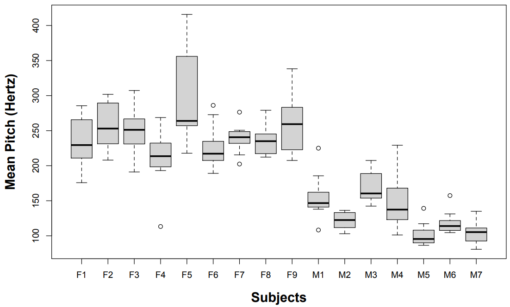
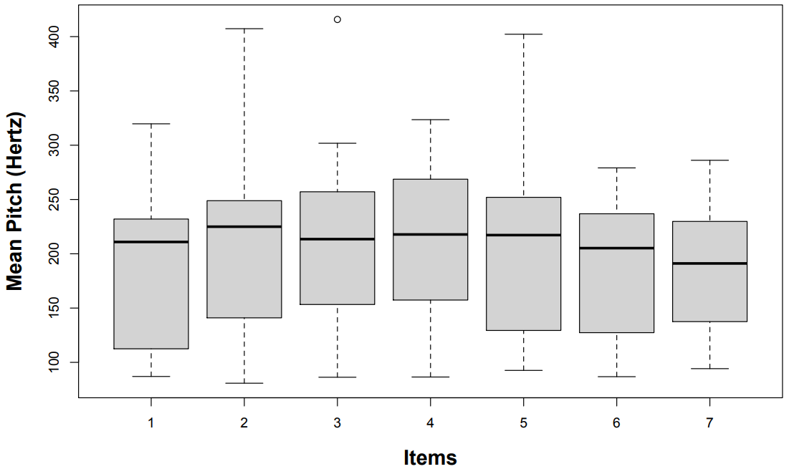
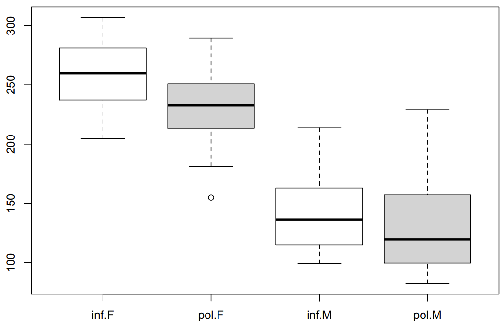

---
title: "STAT340 Lecture 15: Random/mixed effects model"
author: "Keith Levin & Bi Cheng Wu"
output: html_document
knit: (function(inputFile,encoding){rmarkdown::render(
  inputFile,encoding=encoding,output_file=file.path(dirname(inputFile),'index.html'))})
---

<style>
div.footnotes{margin-top:400px}
</style>

```{r setup, include=FALSE}
knitr::opts_chunk$set(echo=T,message=F,warning=F,cache=T,
                      autodep=T,cache.comments=F,fig.align="center")
```

## Main notes

 - [Random v. fixed](https://www.zoology.ubc.ca/~bio501/R/lecturepdf/05.Models%20with%20random%20effects.pdf)
 - [ANOVA table](https://www.stat.purdue.edu/~minzhang/514-Spring08/lecture%20notes/lec13-RandomEffects.pdf)
 - [lme4 cheat sheet](http://eshinjolly.com/pymer4/rfx_cheatsheet.html)
 - [beginner guide to lmer](https://rstudio-pubs-static.s3.amazonaws.com/63556_e35cc7e2dfb54a5bb551f3fa4b3ec4ae.html)

### Simplest example: 1 random effect

```{r}
library(tidyverse)

# table copied from loom example in second link
looms = read.table(text="1 98 97 99 96
2 91 90 93 92
3 96 95 97 95
4 95 96 99 98") %>% 
  column_to_rownames("V1") %>% 
  t %>% 
  as.data.frame %>% 
  remove_rownames %>% 
  pivot_longer(1:4,names_to="loom",values_to="strength") %>% 
  arrange(loom)

print(looms,n=Inf)
```

```{r}
library(lme4)

lmer.looms = lmer(strength ~ (1 | loom), data=looms)

summary(lmer.looms)
fixef(lmer.looms)
ranef(lmer.looms)

confint(profile(lmer.looms))
```

```{r,fig.width=6.5,fig.height=3.5}
par(mfrow=c(1,2),cex=.6)
plot(fitted(lmer.looms),resid(lmer.looms),main="Resid v. fitted")
qqnorm(resid(lmer.looms))
```

```{r}
# getting equivalent ANOVA table by running anova() of fixed-effect version
anova(aov(strength ~ loom, data=looms))
```


### Example 2: mixed effect model

<small>This example adapted from [here](https://bodowinter.com/tutorial/bw_LME_tutorial2.pdf).</small>

[This dataset](https://pastebin.com/raw/SC6Likfa) was collected from an experiment done on how someone's pitch (i.e. frequency of sound) changed depending on politeness and scenario ^[https://www.researchgate.net/publication/256935591_The_phonetic_profile_of_Korean_formal_and_informal_speech_registers]. Subjects were asked to imagine a certain scenario and then asked to read a line in either a formal or an informal register. From the original study:

>  In the design that we used, there’s an additional source of non-independence that needs to be accounted for: We had different items. One item, for example, was an “asking for a favor” scenario. Here, subjects had to imagine asking a professor for a favor (polite condition), or asking a peer for a favor (informal condition). Another item was an “excusing for coming too late” scenario, which was similarly divided between polite and informal. In total, there were 7 such different items.

Below are two plots showing the mean pitch for different subjects and also for different items (scenarios) that were provided.

<center></center>
<center></center>

In the original paper, the researcher decided to fit **politeness and sex as fixed effects** (because they represent two specific levels of interest that could bet reated as having fixed, constant values over the entire population), and to fit the **subjects and items as random effects** (because these represent a sample of non-specific levels whose specific values are NOT interesting, and which are drawn from a group of many other possible subjects/items). They arrived at a model equation like this:

> pitch ~ politeness + sex + (1 | subject) + (1 | item) + e

This is called a mixed effects model due to the presence of **both random and fixed effects**. The flexibility of these mixed effect model structures allows you to more accurately represent the experimental design and thus the variance structure of the data.

Boxplots showing the breakdown of mean pitch by politeness and sex.

<center></center>

```{r}
politeness = read_csv("https://pastebin.com/raw/SC6Likfa")

lmer.polite = lmer(frequency~attitude+gender+(1|subject)+(1|scenario), data=politeness)
summary(lmer.polite)

ranef(lmer.polite)
fixef(lmer.polite)

confint(profile(lmer.polite))
```

Unfortunately, computing $p$-values becomes slightly more complicated, and there's different approaches. One of the easier approaches is to use a likelihood ratio test. We **fit two versions of the model, one with the term we want to test, and one without**, and then use the `anova()` function to compare the two. For `lmer()` fits, make sure to set **REML=FALSE** in the fit (two fits with REML=TRUE cannot be compared against each other).

For this example, we wish to find if politeness affects pitch, so we can compare the following models against each other:

```{r}
lmer.polite.reduced = lmer(frequency~gender+(1|subject)+(1|scenario), data=politeness, REML=FALSE)
lmer.polite.full    = lmer(frequency~attitude+gender+(1|subject)+(1|scenario), data=politeness, REML=FALSE)

anova(lmer.polite.reduced,lmer.polite.full)
```

This could be interpreted in the following way:

> "... politeness significantly affected pitch ($\chi^2_1=11.62$, $p=0.00065$), lowering it by about 19.7 Hz $\pm$ 5.6 (standard errors) ..."

```{r,fig.width=6.5,fig.height=3.5}
par(mfrow=c(1,2),cex=.6)
plot(fitted(lmer.polite),resid(lmer.polite),main="Resid v. fitted")
qqnorm(resid(lmer.polite))
```


##### ***Some other examples to briefly scan over***

 - [Example](https://stats.idre.ucla.edu/r/dae/mixed-effects-logistic-regression) using `glmer()` to fit a mixed effects logistic regression model to predict
 - [Nature paper](https://www.nature.com/articles/nmeth.3137.epdf) discussion flexibility of mixed effects models
 - [Example](https://lme4.r-forge.r-project.org/slides/2009-07-07-Rennes/3LongitudinalD.pdf) of using `lmer()` to analyze the famous sleep deprivation dataset, which has a longitudinal component

<br/>

***

<br/>

### Brief detour: Likelihood Ratio Test

<small>largely adapted from [source](http://www.maths.qmul.ac.uk/~bb/MS_Lectures_23and24.pdf)</small><br/><br/>

The likelihood ratio test is a **very** broad and generalizable method of testing hypotheses that is extremely versatile.

Define null hypothesis $H_{0}: \boldsymbol{\theta} \in \Theta^{\star}$ (meaning the parameter $\theta$ (which is allowed to be a vector) is in the restricted (i.e. nested) set $\Theta^{\star}$) against the alternative hypothesis $H_{1}: \boldsymbol{\theta} \in \Theta \backslash \Theta^{\star}$ (meaning $\theta$ is allowed to be in the more general set $\Theta\backslash \Theta^{\star}$).

Then, define the following likelihood ratio test statistic where $L(\boldsymbol{\theta} \mid \boldsymbol{y})$ represents the likelihood function for $\theta$.

$$
\lambda(\boldsymbol{y})=\frac{\max _{\boldsymbol{\theta} \in \Theta^{\star}} L(\boldsymbol{\theta} \mid \boldsymbol{y})}{\max _{\boldsymbol{\theta} \in \Theta} L(\boldsymbol{\theta} \mid \boldsymbol{y})}
$$

We can use this to define a test where we choose some value $a$ such that rejecting a true null hypothesis when $\lambda(\boldsymbol{Y})\leq a$ has probability $\alpha$. In other words, we choose some threshold critical value $a$ that controls the type I error rate at $\alpha$

$$
P\left(\lambda(\boldsymbol{Y}) \leq a \mid H_{0}\right)=\alpha
$$

If we let $\hat{\boldsymbol\theta}$ denote the maximum likelihood estimate of $\boldsymbol{\theta}$ and let $\widehat{\boldsymbol{\theta}}_{0}$ denote the value of $\boldsymbol\theta$ which maximizes the likelihood over all values of $\boldsymbol{\theta}$ in $\Theta^{\star}$, then we may write

$$
\lambda(\boldsymbol{y})=\frac{L(\hat{\boldsymbol{\theta}}_{0} \mid \boldsymbol{y})}{L(\hat{\boldsymbol{\theta}} \mid \boldsymbol{y})}
$$

The quantity $\widehat{\boldsymbol\theta}_{0}$ is called the restricted maximum likelihood estimate of $\boldsymbol\theta$ under $H_{0} .$

<br/>

##### ***Example 1: Normal distribution hypothesis test***

Suppose that $Y_{i} \stackrel{i.i.d}{\sim}{\mathcal{N}}\left(\mu, \sigma^{2}\right)$ and consider testing $H_{0}: \mu=\mu_{0}$ against $H_{1}: \mu \neq \mu_{0}$. Then the likelihood is

$$
L\left(\mu, \sigma^{2} \boldsymbol{y}\right)=\left(2 \pi \sigma^{2}\right)^{-\frac{n}{2}} \exp \left\{-\frac{1}{2 \sigma^{2}} \sum_{i=1}^{n}\left(y_{i}-\mu\right)^{2}\right\}
$$

The maximum likelihood estimate of $\boldsymbol{\theta}=\left(\mu, \sigma^{2}\right)^{\mathrm{T}}$ is $\widehat{\boldsymbol{\theta}}=\left(\widehat{\mu}, \widehat{\sigma^{2}}\right)^{\mathrm{T}}$, where $\widehat{\mu}=\bar{y}$ and $\widehat{\sigma}^{2}=\sum_{i=1}^{n}\left(y_{i}-\bar{y}\right)^{2} / n$.

Similarly, the restricted maximum likelihood estimate of $\boldsymbol{\theta}=\left(\mu, \sigma^{2}\right)^{\mathrm{T}}$ under $H_{0}$ is $\widehat{\boldsymbol{\theta}}_{0}=\left(\widehat{\mu}_{0}, \widehat{\sigma^{2}}_{0}\right)^{\mathrm{T}}$, where $\widehat{\mu}_{0}=\mu_{0}$ and $\widehat{\sigma}_{0}^{2}=\sum_{i=1}^{n}\left(y_{i}-\mu_{0}\right)^{2} / n .$

Thus, the generalized likelihood ratio is

$$
\begin{aligned}
\lambda(\boldsymbol{y})=\frac{L\left(\mu_{0}, \hat{\sigma}_{0}^{2} \mid \boldsymbol{y}\right)}{L\left(\hat{\mu}, \hat{\sigma}^{2} \mid \boldsymbol{y}\right)} &=\frac{\left(2 \pi \hat{\sigma}_{0}^{2}\right)^{-\frac{n}{2}} \exp \left\{-\frac{1}{2 \hat{\sigma}_{0}^{2}} \sum_{i=1}^{n}\left(y_{i}-\mu_{0}\right)^{2}\right\}}{\left(2 \pi \hat{\sigma}^{2}\right)^{-\frac{n}{2}} \exp \left\{-\frac{1}{2 \hat{\sigma}^{2}} \sum_{i=1}^{n}\left(y_{i}-\bar{y}\right)^{2}\right\}} \\
&=\left(\frac{\hat{\sigma}^{2}}{\hat{\sigma}_{0}^{2}}\right)^{\frac{n}{2}} \exp \left\{\frac{n \sum_{i=1}^{n}\left(y_{i}-\bar{y}\right)^{2}}{2 \sum_{i=1}^{n}\left(y_{i}-\bar{y}\right)^{2}}-\frac{n \sum_{i=1}^{n}\left(y_{i}-\mu_{0}\right)^{2}}{2 \sum_{i=1}^{n}\left(y_{i}-\mu_{0}\right)^{2}}\right\} \\
&=\left\{\frac{\sum_{i=1}^{n}\left(y_{i}-\bar{y}\right)^{2}}{\sum_{i=1}^{n}\left(y_{i}-\mu_{0}\right)^{2}}\right\}^{\frac{n}{2}}
\end{aligned}
$$

Then, there exists some $a$ such that we reject $H_{0}$ if

$$
\left\{\frac{\sum_{i=1}^{n}\left(y_{i}-\bar{y}\right)^{2}}{\sum_{i=1}^{n}\left(y_{i}-\mu_{0}\right)^{2}}\right\}^{\frac{n}{2}} \leq a \Rightarrow \frac{\sum_{i=1}^{n}\left(y_{i}-\bar{y}\right)^{2}}{\sum_{i=1}^{n}\left(y_{i}-\mu_{0}\right)^{2}} \leq b
$$

where $a$ and $b$ are constants chosen to give significance level $\alpha$. Now, we may write

$$
\begin{aligned}
\sum_{i=1}^{n}\left(y_{i}-\mu_{0}\right)^{2} &=\sum_{i=1}^{n}\left\{\left(y_{i}-\bar{y}\right)+\left(\bar{y}-\mu_{0}\right)\right\}^{2} \\
&=\sum_{i=1}^{n}\left(y_{i}-\bar{y}\right)^{2}+2\left(\bar{y}-\mu_{0}\right) \sum_{i=1}^{n}\left(y_{i}-\bar{y}\right)+n\left(\bar{y}-\mu_{0}\right)^{2} \\
&=\sum_{i=1}^{n}\left(y_{i}-\bar{y}\right)^{2}+n\left(\bar{y}-\mu_{0}\right)^{2}
\end{aligned}
$$

So we reject $H_{0}$ if

$$
\frac{\sum_{i=1}^{n}\left(y_{i}-\bar{y}\right)^{2}}{\sum_{i=1}^{n}\left(y_{i}-\bar{y}\right)^{2}+n\left(\bar{y}-\mu_{0}\right)^{2}} \leq b
$$

Thus, rearranging, we reject $H_{0}$ if

$$
1+\frac{n\left(\bar{y}-\mu_{0}\right)^{2}}{\sum_{i=1}^{n}\left(y_{i}-\bar{y}\right)^{2}} \geq c \Rightarrow \frac{n\left(\bar{y}-\mu_{0}\right)^{2}}{\frac{1}{n-1} \sum_{i=1}^{n}\left(y_{i}-\bar{y}\right)^{2}} \geq d,
$$

where $c$ and $d$ are constants chosen to give significance level $\alpha$, that is we can write

$$
\alpha=P\left(\lambda(\boldsymbol{Y}) \leq a \mid H_{0}\right)=P\left(\frac{n\left(\bar{Y}-\mu_{0}\right)^{2}}{S^{2}} \geq d \mid H_{0}\right)
$$

where $S^{2}=\frac{1}{n-1} \sum_{i=1}^{n}\left(Y_{i}-\bar{Y}\right)^{2}$.

To get $d$ we need to work out the distribution of $\frac{n\left(\bar{Y}-\mu_{0}\right)^{2}}{S^{2}}$ under the null hypothesis. For $Y_{i} \sim \mathcal{N}\left(\mu, \sigma^{2}\right)$ we have

$$
\bar{Y} \sim N\left(\mu, \frac{\sigma^{2}}{n}\right)
$$

and so, under $H_{0}$,

$$
\bar{Y} \sim \mathcal{N}\left(\mu_{0}, \frac{\sigma^{2}}{n}\right) \quad \text {and}\quad \frac{\sqrt{n}\left(\bar{Y}-\mu_{0}\right)}{\sqrt{\sigma^{2}}} \sim \mathcal{N}(0,1) .
$$

By Cochran's theorem, we have

$$
\frac{n\left(\bar{Y}-\mu_{0}\right)^{2}}{\sigma^{2}} \sim \chi_{1}^{2} \quad\text{and}\quad \frac{(n-1) S^{2}}{\sigma^{2}} \sim \chi_{n-1}^{2}
$$

Now we may use the fact that if $U$ and $V$ are independent rvs such that $U \sim \chi_{\nu_{1}}^{2}$ and $V \sim \chi_{\nu_{2}}^{2}$, then $\frac{U / \nu_{1}}{V / \nu_{2}} \sim \mathcal{F}_{\nu_{1}, \nu_{2}}$.
Here, $U=\frac{n\left(\bar{Y}-\mu_{0}\right)^{2}}{\sigma^{2}}$ and $V=\frac{(n-1) S^{2}}{\sigma^{2}}$. Hence, if $H_{0}$ is true, we have

$$
F=\frac{U / 1}{V /(n-1)}=\frac{n\left(\bar{Y}-\mu_{0}\right)^{2}}{S^{2}} \sim \mathcal{F}_{1, n-1} .
$$

Therefore, we reject $H_{0}$ at a significance level $\alpha$ if

$$
\frac{n\left(\bar{y}-\mu_{0}\right)^{2}}{s^{2}} \geq F_{1, n-1, \alpha}
$$

where $F_{1, n-1, \alpha}$ is such that $P\left(F \geq F_{1, n-1, \alpha}\right)=\alpha$.
Using the fact that an $F$ distribution with $1$ and $n-1$ degrees of freedom is equivalent to the square of a $t$-statistic with $n-1$ degrees of freedom, we reject $H_{0}$ if

$$
\sqrt{\frac{n\left(\bar{y}-\mu_{0}\right)^{2}}{s^{2}}} \geq t_{n-1, \frac{\alpha}{2}},
$$

that is, if

$$
\left|\frac{\bar{y}-\mu_{0}}{\sqrt{s^{2} / n}}\right| \geq t_{n-1, \frac{\alpha}{2}}
$$

Of course, this is the usual two-sided $t$-test

> It can be shown that ***all the standard tests in situations with normal distributions are generalized likelihood ratio tests***.

<br/>

### Wilks' theorem

[Samuel S. Wilks](https://en.wikipedia.org/wiki/Samuel_S._Wilks) derived (in a 3 page paper) a much more generalized form of this, now known as Wilks' theorem

> Assume that the joint distribution of $Y_{1}, \ldots, Y_{n}$ depends on $p$ unknown parameters and that, under $H_{0}$, the joint distribution depends on $p_{0}$ unknown parameters. Let $\nu=p-p_{0}$. Then, under some regularity conditions, when the null hypothesis is true, the distribution of the statistic $-2 \log \{\lambda(\boldsymbol{Y})\}$ converges to a $\chi_{\nu}^{2}$ distribution as the sample size $n \rightarrow \infty$, i.e., when $H_{0}$ is true and $n$ is large,
> $$-2 \log \{\lambda(\boldsymbol{Y})\} \underset{\text { approx. }}{\sim} \chi_{\nu}^{2}$$
> Thus, for large $n$, the critical region for a test with approximate significance level $\alpha$ is
> $$\mathcal{R}=\left\{\boldsymbol{y}:-2 \log \{\lambda(\boldsymbol{y})\} \geq \chi_{\nu, \alpha}^{2}\right\}$$

In other words, the likelihood ratio test of 2 competing hypotheses is approximately distributed according to a chi-square distribution with $\nu$ degrees of freedom, where $\nu$ is the difference in number of parameters between the two models.

This is why the likelihood ratio test we performed on the politeness term followed a chi-square distribution with 1 degree of freedom: the politeness term adds 1 parameter to be estimated to the model.

<br/>

##### ***Example 2: Poisson variable***

Suppose that $Y_{i} \sim \operatorname{Poisson}(\lambda)$ and consider testing $H_{0}: \lambda=\lambda_{0}$ against $H_{1}: \lambda \neq \lambda_{0}$. Now, the likelihood is

$$
L(\lambda \mid \boldsymbol{y})=\frac{\lambda^{\sum_{i=1}^{n} y_{i}} e^{-n \lambda}}{\prod_{i=1}^{n} y_{i} !}
$$

The maximum likelihood estimate of $\lambda$ is $\hat{\lambda}=\bar{y}$ and the restricted maximum likelihood estimate of $\lambda$ under $H_{0}$ is $\hat{\lambda}_{0}=\lambda_{0}$. Thus, the generalized likelihood ratio is

$$
\begin{aligned}
\lambda(\boldsymbol{y})=\frac{L\left(\lambda_{0} \mid \boldsymbol{y}\right)}{L(\hat{\lambda} \mid \boldsymbol{y})} &=\frac{\lambda_{0}^{\sum_{i=1}^{n} y_{i}} e^{-n \lambda_{0}}}{\prod_{i=1}^{n} y_{i} !} \frac{\prod_{i=1}^{n} y_{i} !}{\bar{y}^{\sum_{i=1}^{n} y_{i}} e^{-n \bar{y}}} \\
&=\left(\frac{\lambda_{0}}{\bar{y}}\right)^{\sum_{i=1}^{n} y_{i}} e^{n\left(\bar{y}-\lambda_{0}\right)}
\end{aligned}
$$

It follows that

$$
\begin{aligned}
-2 \log \{\lambda(\boldsymbol{y})\} &=-2\left\{n \bar{y} \log \left(\frac{\lambda_{0}}{\bar{y}}\right)+n\left(\bar{y}-\lambda_{0}\right)\right\} \\
&=2 n\left\{\bar{y} \log \left(\frac{\bar{y}}{\lambda_{0}}\right)+\lambda_{0}-\bar{y}\right\}
\end{aligned}
$$

Here, $p=1$ and $p_{0}=0$, and so $\nu=1$. Therefore, by Wilks' theorem, when $H_{0}$ is true and $n$ is large,

$$
2 n\left\{\bar{Y} \log \left(\frac{\bar{Y}}{\lambda_{0}}\right)+\lambda_{0}-\bar{Y}\right\} \sim \chi_{1}^{2} .
$$

Hence, for a test with approximate significance level $\alpha$, we reject $H_{0}$ if and only if

$$
2 n\left\{\bar{y} \log \left(\frac{\bar{y}}{\lambda_{0}}\right)+\lambda_{0}-\bar{y}\right\} \geq \chi_{1, \alpha}^{2} .
$$


<br/>

##### ***Example 3: Model selection using LRT***

 - [Example 1](http://pages.stat.wisc.edu/~ane/st572/notes/lec05.pdf)
 - [Example 2](https://api.rpubs.com/tomanderson_34/lrt)
